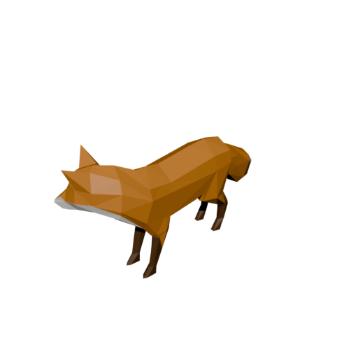
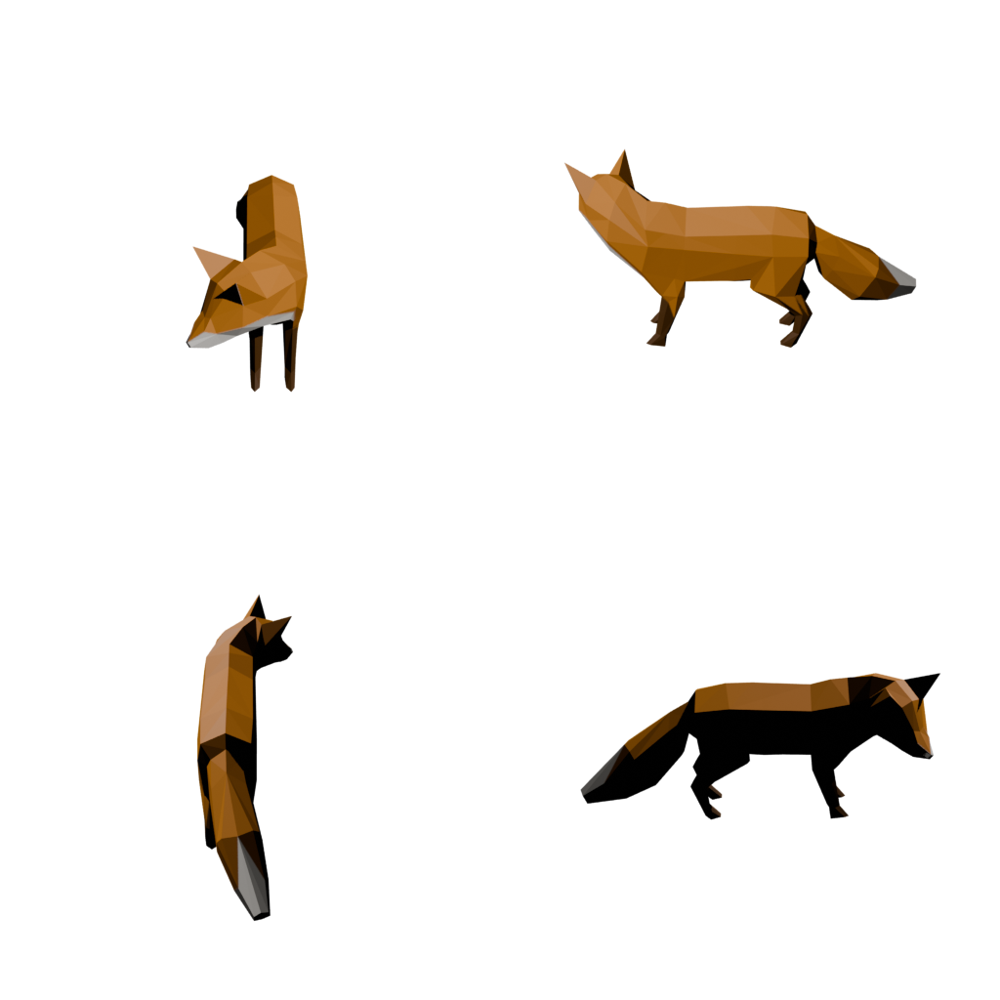

# blender-skill

**Give your coding agent a 3D asset pipeline.** Local Blender, headless, no cloud, no API keys.

## Install

```bash
npx blender-skill                                   # this repo's own installer (Node)
npx skills add kajisho5/blender-skill                # skills.sh registry
gh skill install kajisho5/blender-skill blender-skill  # GitHub CLI 2.90+
```

Any of the three installs `SKILL.md` and `scripts/` where your agent looks for skills. Requires
[Blender](https://www.blender.org/download/) 4.2+ on the machine; the scripts find it themselves
(`--blender` flag, `$BLENDER`, `PATH`, or the OS's usual install location) and tell you how to
install it if they can't.

## Demo

Real output from `examples/make_demo.sh` against `tests/fixtures/fox.glb` -- nothing staged.

<p align="center">
  
  
</p>

A 360° turntable (`render.py --turntable -o turntable.mp4`) is at
[`docs/demo/turntable.mp4`](docs/demo/turntable.mp4). The same run's `info.py`/`check.py` output,
unedited:

```
$ python3 scripts/info.py tests/fixtures/fox.glb
tests/fixtures/fox.glb: 3 object(s), 2 mesh(es), 656 triangles, 1770 vertices
  materials: 1  textures: 1  animations: 3
  warning: fox: 1150 non-manifold edge(s) (hole/gap in the surface, after welding split normals/UV seams) -- try: optimize.py <file> -o <out> --fill-holes
  warning: fox: flipped-normal check skipped (unreliable while non-manifold edges are present -- fix those first, then re-run info.py)

$ python3 scripts/check.py tests/fixtures/fox.glb --target three.js
tests/fixtures/fox.glb vs three.js: PASS
  PASS format: gltf is a recommended format for three.js
  PASS triangle budget: 656 <= 300000
  PASS texture size: all textures <= 4096px
  PASS textures present: no missing texture files
  PASS transmission size: 0.2 MB <= 15 MB
```

Run `bash examples/make_demo.sh` yourself to regenerate all of it (info, optimize, convert
`--verify`, render, look, bake, check) end to end -- needs Blender, see Requirements below.

## What this is / isn't

Inspects, converts, optimizes, renders, bakes and validates 3D assets from natural-language
requests -- for a coding agent working with `.glb`/`.gltf`/`.fbx`/`.obj`/`.stl`/`.usd`/`.usdz`/
`.ply`/`.abc`/`.blend` files, not for someone modeling interactively in Blender's UI. It runs
Blender exclusively headless (`blender -b`) and never opens a window. That makes it a complement
to, not a replacement for, [Blender's own MCP add-on](https://extensions.blender.org/add-ons/bmc/)
or [ahujasid/blender-mcp](https://github.com/ahujasid/blender-mcp) -- use this to check and fix a
file's numbers deterministically (triangle count, texture size, manifoldness, delivery-target
budgets), and a live Blender connection for anything that needs a human's eye on the actual
3D viewport.

## Features

- **`info.py`** -- object/mesh/material/texture/animation/armature counts, unit scale, bounding
  box, non-manifold-edge and duplicate-vertex detection (computed on a welded scratch copy, so a
  perfectly normal hard-edged/UV-seamed mesh isn't misreported as broken), approximate
  self-intersection detection, flipped-normal detection (only reported when trustworthy -- see
  below), unapplied-scale detection (a common cm/m unit-mismatch symptom), origin offset from each
  object's own bounding-box center/bottom-center (data, not a defect -- an off-center origin is
  often deliberate), UV out-of-[0,1]-range/zero-area/overlap detection (out-of-bounds and overlap
  are data, not defects -- tiling textures and mirrored UV islands both use them deliberately;
  zero-area is a real "never actually unwrapped" defect), vertex color layers and other genuinely
  custom mesh attributes (Blender's own non-internal built-ins -- `position`, `material_index`,
  bevel weight, crease -- are excluded), per-animation-clip bone count and root-motion detection
  (whether the armature's own root bone's `location` channel actually moves, vs. an in-place
  cycle meant to be driven by a character controller), bone hierarchy (name/parent per bone) and
  unweighted-vertex detection on skinned meshes (a vertex with no bone weight at all won't move
  with the rig -- skipped, not falsely flagged, on meshes with no armature modifier at all), a
  default LOD1/2/3 triangle-ratio suggestion (50%/25%/10% of the file's current total, with the
  `optimize.py --decimate-ratio` command for each -- a starting-point estimate, not a guarantee),
  a draw-call estimate (one per distinct material a mesh object's faces actually use, not the
  cruder "material count x object count" that overestimates as soon as objects share a material),
  misconfigured-transparency detection (a hard binary-alpha mask, e.g. foliage, using real
  alpha blending instead of the cheaper, sorting-artifact-free dithered mode), (glb/gltf only)
  the file's own `extensionsUsed`/`extensionsRequired` list read straight from its JSON -- with a
  short description per known `KHR_*`/`EXT_*` extension -- since Blender's importer translates
  those into its own representation and doesn't expose which ones the source file declared, and
  duplicate-mesh/instancing detection (objects already sharing one mesh datablock, reported as
  data; objects on *separate* datablocks with identical geometry, flagged as a real "could share
  one datablock" memory-saving opportunity), and (`.obj` only) the referenced `.mtl`'s per-
  material Phong parameters (Ka/Kd/Ks/Ns/d/illum) alongside the same Ns-to-roughness heuristic
  Blender's own OBJ importer applies -- confirmed to match its real output exactly -- since
  OBJ/MTL predates PBR and has no metallic/roughness channels of its own (metallic is never
  guessed: no reliable signal separates a metal from a shiny dielectric in Phong parameters
  alone), ray-cast wall-thickness analysis (a real, testable "3D-Print Toolbox"-style
  thickness check -- that add-on itself is a Blender Extension as of 4.2+, not bundled, so not
  something this skill can assume is installed), and point-cloud detection (a PLY vertices-only
  mesh -- photogrammetry/LiDAR scan data -- reads `is_point_cloud: true` and skips the usual
  no-UV-map warning, which is meaningless for one), each defect naming its fix command where a
  safe one exists.
- **`convert.py`** -- glb/gltf, fbx, obj, stl, usd, usdz, ply, abc, .blend, any direction;
  `--verify` re-imports the output and diffs it against the input.
- **`split.py`** -- split one multi-object file into one output file per independent object
  hierarchy (a root object with no parent, plus every descendant), so a skinned mesh stays with
  its armature while an unrelated standalone object becomes its own file.
- **`anim.py`** -- `--extract` strips every non-armature object, keeping just the skeleton and
  its actions (an animation-only file); `--combine` merges several files' actions (matched by
  bone name) onto one base character into a single output with every action as its own
  exportable clip -- the Mixamo workflow of downloading a rigged character once and several
  separate animation clips for it. Both discard Blender's own synthesized bone-shape display
  widget rather than treating it as real content to preserve (confirmed not to exist in the
  source file's own data -- see `references/pitfalls.md`).
- **`optimize.py`** -- decimate, weld duplicate vertices, recalculate normals, triangulate, fill
  boundary-edge holes (`--fill-holes`), bake unapplied scale into the mesh (`--fix-scale`),
  recenter an object's origin without moving its geometry (`--origin center|bottom`), cap texture
  resolution, purge orphan data, thin a point cloud by voxel-grid downsampling
  (`--point-thin-voxel SIZE` -- a no-op on any mesh that has faces, since that's what
  `--decimate-ratio` is for), convert every texture to WebP (`--webp`, glb/gltf output only,
  adds `EXT_texture_webp`) -- reports the file's own real before/after texture bytes rather than
  assuming a reduction, because WebP at Blender's own default quality can end up *larger* than a
  well-compressed PNG for some textures (confirmed, not hypothetical -- see
  `references/pitfalls.md`; `--webp-quality` gives a lever to actually shrink when that happens);
  `--target-web`/`--target-mobile`/`--target-ar` presets; `--draco`/`--meshopt`/`--ktx2` delegate
  to [gltf-transform](https://github.com/donmccurdy/glTF-Transform) (and, for `--ktx2`, the
  [KTX-Software](https://github.com/KhronosGroup/KTX-Software) `ktx` CLI) when installed, and say
  so and skip just that step when they aren't. `--recalc-normals` warns instead of silently
  trusting its own output on a still-non-manifold mesh -- see `references/pitfalls.md`, this is a
  real failure mode, not a hypothetical one.
- **`render.py`** -- a thumbnail, a 360° turntable (PNG sequence or an FFmpeg-encoded video), or
  a 4-view sheet. Eevee by default, `--cycles` to switch.
- **`look.py`** -- the agent's eyes: a wireframe render, a grid of every texture in the file, a
  before/after comparison, or the UV layout (as SVG -- headless Blender's PNG UV export needs a
  GPU offscreen context `-b` mode doesn't have).
- **`check.py`** -- PASS/WARN/FAIL against a delivery target's budget (three.js, Unity, Unreal,
  Godot, iOS/Android AR, WebXR, 3D printing, Sketchfab), every row naming its fix command; for
  `.usdz` inputs, also validates the package itself against Apple's real USDZ requirements (every
  entry uncompressed and 64-byte-aligned -- read from the file's own zip structure, independent
  of Blender).
- **`bake.py`** -- Cycles-bake a material to a texture (AO/normal/roughness/diffuse/combined);
  `--atlas` repacks UVs across several objects into one shared image first.
- **`scene.py`** -- assemble a declarative `scene.json` (asset placement, lights, camera,
  background) into a render and/or an exported 3D file.
- **`batch.py`** -- chain this skill's own scripts as a recipe over every file in a folder, with
  a content-hash cache so a re-run only reprocesses what changed.
- **`verify.py`** -- the whole toolchain (info → convert --verify → check) over one or more real
  files, PASS/FAIL per file.
- **MCP server** (`mcp/server.py`) -- every script above as an MCP tool over stdio.

## Usage

```
"check this glb for a Unity import"          -> check.py model.glb --target unity
"cut this to 50k triangles"                  -> info.py, then optimize.py --decimate-ratio ...
"convert this fbx to usdz and confirm it worked" -> convert.py model.fbx -o model.usdz --verify
"make a turntable of this model"             -> render.py model.glb --turntable -o turntable.mp4
"bake this material to a single texture"     -> bake.py model.glb --pass combined -o baked.png
```

## Scripts

| Script | Purpose |
|---|---|
| `info.py` | Inspect: counts, scale, bounding box, manifold/UV checks |
| `convert.py` | Cross-format conversion, with round-trip `--verify` |
| `split.py` | Split a multi-object file into one file per independent object hierarchy |
| `anim.py` | Extract animation-only data, or combine several files' actions (Mixamo workflow) |
| `optimize.py` | Decimate, weld, triangulate, cap texture size, purge unused, Draco/Meshopt/KTX2 (delegated) |
| `render.py` | Thumbnail, turntable, 4-view sheet |
| `look.py` | Wireframe, texture grid, before/after compare, UV layout |
| `check.py` | Delivery-target PASS/WARN/FAIL with fix commands |
| `bake.py` | Material-to-texture baking, with UV-atlas repacking |
| `scene.py` | Declarative multi-asset scene assembly |
| `batch.py` | Recipe chains over a folder, with a content-hash cache |
| `verify.py` | The whole toolchain over real files |

See `references/pitfalls.md` for the real gotchas found building this (GPU-offscreen limits
under `-b`, an Eevee engine-name rename between Blender versions, format round-trip quirks) and
`references/blender-versions.md` for which Blender versions have actually been tested.

## MCP

```json
{
  "mcpServers": {
    "blender-skill": {
      "command": "python3",
      "args": ["/path/to/blender-skill/mcp/server.py"]
    }
  }
}
```

Each tool takes one argument, `argv`: the exact CLI arguments you'd pass to that script.

## Requirements

- [Blender](https://www.blender.org/download/) 4.2 or newer (LTS releases tested: 4.2, 4.5;
  latest tested: 5.2 -- see `references/blender-versions.md`)
- Python 3.9+ for the host-side scripts (standard library only, no `pip install`)
- Node.js 16+ only for the `npx blender-skill` installer itself

## Development

```bash
git clone https://github.com/kajisho5/blender-skill
cd blender-skill
python3 tests/test_all.py
```

See [CONTRIBUTING.md](CONTRIBUTING.md) and [ROADMAP.md](ROADMAP.md) for what's planned next.

## License

MIT -- see [LICENSE](LICENSE).
